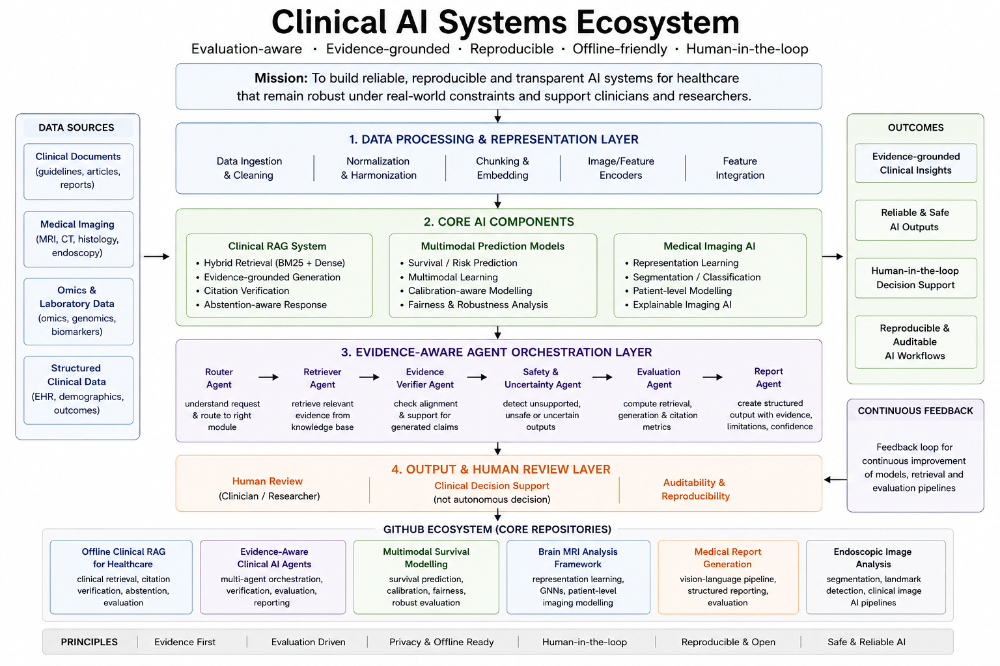

# Toktam Khatibi

Clinical AI Systems Researcher working on medical imaging, clinical RAG, multimodal healthcare AI, and evaluation-aware machine learning systems under real-world deployment constraints.

When I was working on healthcare AI pipelines and clinical retrieval systems, I gradually realised that benchmark performance alone was not enough for deployable clinical AI systems. In healthcare settings, issues such as retrieval reliability, evidence alignment, uncertainty handling, reproducibility, and safe failure behaviour become very important during real operational usage.

Therefore, my recent work focuses more on evaluation-driven clinical AI systems, offline and low-resource deployment settings, multimodal healthcare machine learning, and evidence-aware AI workflows instead of generation quality alone.

My repositories mainly explore:

- clinical Retrieval-Augmented Generation (RAG)
- multimodal healthcare AI
- medical imaging and representation learning
- evaluation-aware AI systems
local/offline AI deployment
- uncertainty-aware and reproducible machine learning workflows

## Clinical AI Systems Ecosystem

The repositories in this profile are designed around a broader clinical AI systems perspective rather than isolated model development. The ecosystem focuses on how retrieval, multimodal learning, evaluation, uncertainty handling, and deployment constraints interact within real-world healthcare AI workflows.

The overall architecture reflects several recurring priorities across my projects:
- evaluation-aware AI system design,
- evidence-grounded clinical workflows,
- offline and low-resource deployment,
- reproducible experimentation,
- and safe failure behaviour under uncertainty.

### Architectural Perspective

The ecosystem separates retrieval, reasoning, verification, evaluation, and deployment concerns into modular components that can be independently analysed and improved.

Instead of focusing only on benchmark optimisation, the repositories explore:
- retrieval reliability,
- calibration-aware modelling,
- uncertainty-aware workflows,
- citation-grounded generation,
- multimodal evidence integration,
- and operational robustness for healthcare AI systems.

This design philosophy is particularly motivated by deployment-oriented healthcare environments where transparency, reproducibility, and failure-awareness are often as important as predictive performance itself.

## Selected Projects

### [Offline Clinical RAG for Healthcare](https://github.com/toktamk/clinical-qa-rag-llm-evaluation-offline-first)

Evaluation-oriented clinical Retrieval-Augmented Generation framework designed for privacy-sensitive and offline healthcare environments.

When I was working on clinical RAG systems, one important issue was not only hallucination itself, but also generated responses that looked convincing despite having weak supporting evidence from retrieved texts. Therefore, this project focuses more on retrieval validation, citation verification, abstention-aware generation, and reproducible evaluation workflows.

**Key Areas**
- Hybrid retrieval pipelines
- Citation-grounded generation
- Retrieval validation
- Hallucination mitigation via abstention-aware response system
- Offline/local deployment workflows
- Evaluation-first clinical QA framework
- Reproducible experimentation

**Technical Stack**
`Python` `LLMs` `RAG` `FAISS` `SentenceTransformers` `FastAPI` `Docker`

### [Evidence-Aware Clinical AI Agents](https://github.com/toktamk/eval-driven-offline-multi-agent-rag)

Local/offline multi-agent clinical AI orchestration system for coordinating retrieval, evidence verification, uncertainty handling, and evaluation-aware reporting workflows.

This repository explores how specialised agents can support safer clinical AI workflows under deployment constraints. The objective is not autonomous diagnosis. Instead, the focus is on separating retrieval, reasoning, verification, evaluation, and reporting into transparent and auditable components.

Main areas:

multi-agent orchestration
evidence verification workflows
clinical retrieval coordination
uncertainty-aware task routing
evaluation-aware generation
safe failure mechanisms
local/offline deployment

### [Multimodal Survival Modelling](https://github.com/toktamk/BreastCancerStudy)

End-to-end multimodal framework for survival prediction integrating clinical and omics data for robust risk stratification and calibration-aware evaluation.

One important issue in survival modelling is that high discrimination performance alone may not reflect reliable risk estimation under different cohorts and operational conditions. Therefore, this project also focuses on calibration, robustness analysis, fairness evaluation, and reproducible patient-level experimentation.

**Key Areas**
- Multimodal learning
- Survival prediction pipelines
- Calibration-aware evaluation
- Fairness and robustness analysis
- Explainable risk prediction
- Patient-level reproducible workflows
  
**Selected Results**
- AUROC: **0.967**
- Brier Score: **0.064**

**Technical Stack**
`PyTorch` `Survival Analysis` `XGBoost` `SHAP` `Scikit-learn`

### [Brain MRI Analysis & Representation Learning](https://github.com/toktamk/BrainMRIAnalysis)

Research-oriented framework for patient-level brain MRI modelling using self-supervised learning and graph-based representation learning approaches.

This repository explores representation learning workflows for medical imaging analysis while focusing on reproducibility, modular experimentation, and patient-level evaluation instead of architecture complexity alone.

**Key Areas**
- Self-supervised representation learning
- Graph neural networks
- Medical image analysis
- Patient-level modelling
- Neuroimaging analytics
- Reproducible Imaging workflows
  
**Technical Stack**
`PyTorch` `MONAI` `Medical Imaging` `CNNs` `Transformers` `GNNs`

## Technical Areas

Clinical AI • Medical Imaging • Clinical RAG • Multimodal Learning • Survival Analysis • Evaluation Pipelines • Retrieval Systems • Healthcare NLP • Representation Learning • Reproducible Machine Learning

## Research Perspective

I am particularly interested in healthcare AI systems that remain reliable under operational constraints and low-resource deployment settings.

When working with local/offline clinical AI systems, I gradually realised that issues such as reproducibility, deterministic behaviour, retrieval validation, latency, uncertainty handling, and maintainability become more important during real deployment compared to benchmark-oriented experimentation alone.

This changed the way I think about AI system development and evaluation in healthcare environments.

## Links

[**Google Scholar**](scholar.google.com/citations?user=qmy_4oEAAAAJ)

[**LinkedIn**](https://linkedin.com/in/toktamkhatibi77271683)

[**GitHub**](https://github.com/toktamk)
